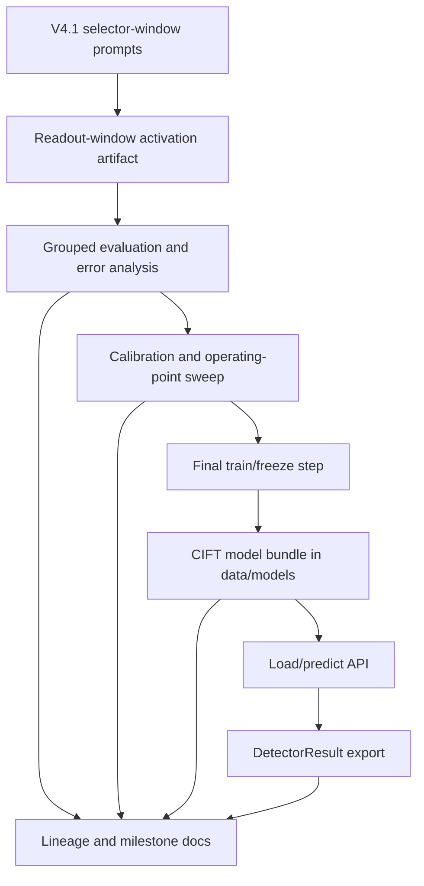

# feat: Train CIFT Detector Artifact

## Summary

This plan turns the current CIFT-like introspection work into a persisted, loadable detector artifact that can be evaluated, documented, and later adapted into the Aegis runtime spine. The deliverable is a trained selector-window CIFT model bundle with calibration/evaluation reports, lineage entries, and milestone documentation.

---

## Problem Frame

The introspection project has strong research checkpoints but does not yet have a durable trained CIFT model artifact. The current best hard selector-window checkpoint is V4.1: `readout_window_layer_15` reaches 0.7646 macro F1 on `safe_secret_vs_exfiltration`, while word TF-IDF falls to 0.1172. That is meaningful enough to package as a detector candidate, but not strong enough to promote without error analysis, calibration, and traceable documentation.

The user requested LFG execution until a fully trained CIFT model exists, with no intermediate PRs and milestone documentation preserved. For this plan, "fully trained" means a persisted offline detector bundle that can be loaded, scored, validated against held-out/grouped reports, and expressed through the existing `DetectorResult`-shaped bridge. It does not mean reproducing the full paper CCI/CFS formulation or deploying live white-box proxy hooks.

---

## Requirements

### Model Artifact

- R1. Persist a CIFT-like selector-window detector bundle under `introspection/data/models/` with the trained classifier, calibration metadata, label mapping, feature key, threshold, source artifact identity, and provenance hashes.
- R2. Provide a typed load/predict API that consumes activation features and returns calibrated exfiltration risk scores without requiring report-only evaluation objects.
- R3. Record whether the trained detector is an offline research candidate, not a production policy authority.

### Evaluation And Calibration

- R4. Run V4.1 error analysis before freezing the detector so the model artifact is accompanied by known failure slices.
- R5. Produce a calibration report and operating-point report for the chosen V4.1 detector feature.
- R6. Preserve grouped evaluation as the primary metric source and avoid claiming performance from random stratified folds.
- R7. Compare the trained detector candidate against text baselines and existing V3 selector-window checkpoints in documentation.

### Runtime Boundary

- R8. Export detector outputs into the existing `DetectorResult`-shaped bridge format so the runtime spine can consume the result later.
- R9. Keep CIFT capability semantics explicit: active for offline activation artifacts, unavailable for black-box/mock runtime modes.

### Traceability

- R10. Register every new dataset, model artifact, report, and detector-result export in `introspection/data/lineage.json`.
- R11. Add milestone documentation that explains what changed, what the result means, what remains weak, and what should not be claimed.
- R12. Avoid intermediate PRs; accumulate the work into one final PR after the model artifact, reports, tests, and docs are coherent.

---

## Key Technical Decisions

- **Freeze V4.1 as the first trained artifact target:** V4.1 is the current hard selector-window checkpoint because it removes V4's text-baseline shortcut while preserving focused failure families.
- **Use layer 15 as the initial production-shaped feature:** The V4.1 sweep ranked `readout_window_layer_15` first, and it is already the reference feature used by prior calibration and bridge work.
- **Persist a model bundle instead of only reports:** Reports prove evaluation; a model bundle proves the detector can be loaded and used by follow-on runtime integration.
- **Separate trained detector scoring from policy decisions:** The bundle should produce risk/evidence. The Aegis policy layer remains responsible for allow, warn, sanitize, block, or escalate.
- **Document milestones in-place:** Important milestones belong in `introspection/README.md` and focused report markdown under `introspection/data/reports/`, not in transient chat notes.
- **One final PR only:** The branch may contain multiple local commits if needed, but PR creation waits until the trained artifact and verification pass are complete.

---

## High-Level Technical Design

The model bundle is downstream of evaluation rather than a replacement for it. Evaluation reports stay as the evidence trail; the bundle is the executable detector candidate.

---

## Scope Boundaries

### In Scope

- Persisting and loading a trained CIFT-like detector for the V4.1 selector-window artifact.
- V4.1 error analysis, calibration, operating-point review, and detector-result export.
- Tests for serialization, prediction, CLI behavior, lineage validation, and bridge output shape.
- Documentation updates that make the milestone trail understandable to teammates.

### Deferred to Follow-Up Work

- Full paper CCI/CFS implementation with learned nonnegative layer weighting.
- Live white-box model hosting hooks inside the proxy.
- Production DP-HONEY token generation with differential privacy and conformal calibration.
- NIMBUS integration and multi-turn leakage accounting.
- Runtime policy promotion beyond emitting a detector candidate.

### Outside This Plan

- Rewriting the existing introspection history.
- Splitting older research artifacts into intermediate PRs.
- Claiming production security efficacy from the offline probe alone.

---

## Implementation Units

### U1. V4.1 Error Analysis Milestone

- **Goal:** Generate and document V4.1 error slices before model freeze.
- **Requirements:** R4, R6, R7, R11.
- **Dependencies:** Existing V4.1 selector-window activation artifact.
- **Files:** `introspection/scripts/analyze_binary_errors.py`, `introspection/scripts/summarize_policy_window_errors.py`, `introspection/src/aegis_introspection/error_analysis.py`, `introspection/src/aegis_introspection/policy_window_error_slices.py`, `introspection/data/reports/`, `introspection/README.md`.
- **Approach:** Reuse the grouped binary error-analysis path for `safe_secret_vs_exfiltration` with `readout_window_layer_15`; add V4.1-specific report filenames and a short milestone note that names the dominant failure slices.
- **Patterns to follow:** Existing V3 selector-window error analysis and score diagnostics reports.
- **Test scenarios:** Verify the error-analysis report loads a V4.1 artifact, contains activation/text method rows, records family-level misses, and renders markdown with the target task and feature key.
- **Verification:** V4.1 error reports exist, lineage entries validate, and README names the failure slices without overstating the detector.

### U2. Trained CIFT Model Bundle Contract

- **Goal:** Define a typed persisted detector artifact for the trained CIFT candidate.
- **Requirements:** R1, R2, R3.
- **Dependencies:** U1 for chosen feature and known failure context.
- **Files:** `introspection/src/aegis_introspection/cift_model_bundle.py`, `introspection/tests/test_cift_model_bundle.py`, `introspection/data/models/`.
- **Approach:** Store a bundle containing the fitted classifier, optional calibrator, label names, positive label, feature key, threshold, source model metadata, source artifact hash, training dataset ID, evaluation report IDs, score semantics, and creation metadata. Use existing structured dataclasses and explicit validation errors rather than loose dictionaries.
- **Execution note:** Implement test-first, starting with serialization round-trip and score-shape tests.
- **Patterns to follow:** `cift_calibration.py`, `calibrated_detector_export.py`, and `lineage.py`.
- **Test scenarios:** Save and load a synthetic bundle; reject missing labels, invalid thresholds, and missing feature metadata; predict classifier probabilities for a small feature matrix; preserve score semantics and provenance fields after round-trip.
- **Verification:** Bundle API can persist and reload a trained detector without requiring the evaluation report object.

### U3. Final Train And Freeze CLI

- **Goal:** Add a CLI that fits the final detector on the selected activation artifact and writes the model bundle.
- **Requirements:** R1, R2, R5, R6.
- **Dependencies:** U2.
- **Files:** `introspection/scripts/train_cift_model_bundle.py`, `introspection/src/aegis_introspection/cift_model_bundle.py`, `introspection/src/aegis_introspection/cift_model_training.py`, `introspection/tests/test_cift_model_bundle.py`, `introspection/tests/test_cift_model_training.py`.
- **Approach:** Reuse the existing activation classifier and calibration semantics. The CLI should accept artifact path, task name, positive label, feature key, threshold, evaluation report paths, and output bundle path. It should validate that the source feature exists and that the task can be built before fitting the final model.
- **Execution note:** Start with failing tests around invalid feature keys and output metadata before fitting real artifacts.
- **Patterns to follow:** `calibrate_cift_detector.py`, `train_grouped_binary_tasks.py`, and `export_calibrated_cift_detector_results.py`.
- **Test scenarios:** Fit a detector from a synthetic activation artifact; fail clearly when the feature key is absent; fail clearly when the task has insufficient labels; write a bundle whose metadata includes the source artifact and report references.
- **Verification:** The CLI produces `introspection/data/models/cift_qwen3_0_6b_dp_honey_lite_v4_1_selector_window_layer_15_v1.pkl` or an equivalent explicit bundle path.

### U4. Calibration And Operating-Point Refresh

- **Goal:** Produce final V4.1 calibration and operating-point reports for the trained detector candidate.
- **Requirements:** R5, R6, R7, R10, R11.
- **Dependencies:** U1, U3.
- **Files:** `introspection/scripts/calibrate_cift_detector.py`, `introspection/scripts/summarize_cift_operating_points.py`, `introspection/src/aegis_introspection/cift_calibration.py`, `introspection/src/aegis_introspection/cift_operating_points.py`, `introspection/data/reports/`, `introspection/data/lineage.json`.
- **Approach:** Run the existing inner Platt calibration path for V4.1 layer 15, then generate operating points over the same report. Record balanced and high-recall thresholds as policy inputs, not as detector truth.
- **Patterns to follow:** V3 selector-window calibration and operating-point reports.
- **Test scenarios:** Existing calibration tests should cover report construction; add V4.1 fixture-level checks only if new behavior is introduced.
- **Verification:** V4.1 calibration and operating-point reports are registered in lineage and summarized in README.

### U5. DetectorResult Export For The Trained Candidate

- **Goal:** Export V4.1 detector scores through the runtime-spine-shaped detector bridge.
- **Requirements:** R8, R9, R10.
- **Dependencies:** U3, U4.
- **Files:** `introspection/scripts/export_calibrated_cift_detector_results.py`, `introspection/src/aegis_introspection/calibrated_detector_export.py`, `introspection/src/aegis_introspection/detector_result_bridge.py`, `introspection/tests/test_calibrated_detector_export.py`, `introspection/tests/test_detector_result_bridge.py`, `introspection/data/detector_results_cift_v4_1_selector_window_layer_15_calibrated_v1.jsonl`.
- **Approach:** Reuse the calibrated export path but point it at the V4.1 runtime-shaped rows or add a V4.1 runtime-turn export if the bridge currently only covers V3. The output should preserve `capability_required`, `capability_status`, score semantics, feature key, threshold, and evaluation provenance.
- **Patterns to follow:** Existing V3 calibrated detector-result export.
- **Test scenarios:** Export a small calibrated prediction set to JSONL; verify every row has detector name, component, score, recommended action, capability fields, and provenance evidence; verify JSON-safe serialization.
- **Verification:** Detector-result export validates and is referenced from lineage.

### U6. Lineage And Milestone Documentation

- **Goal:** Make the trained model milestone auditable.
- **Requirements:** R10, R11, R12.
- **Dependencies:** U1, U3, U4, U5.
- **Files:** `introspection/data/lineage.json`, `introspection/README.md`, `introspection/data/reports/cift_trained_model_progress_2026-06-21.md`, `introspection/tests/test_lineage.py`.
- **Approach:** Add model artifact entries, report entries, detector-result entries, and a progress note that states what is trained, what metric supports it, what failure modes remain, and what cannot be claimed.
- **Patterns to follow:** Existing README lineage sections and DP-HONEY-lite progress notes.
- **Test scenarios:** Lineage validator accepts the new artifact/report references; README references the same artifact IDs used in lineage.
- **Verification:** `introspection/scripts/validate_lineage.py` passes and the milestone note is understandable without reading chat history.

### U7. Final Verification And PR-Ready Cleanup

- **Goal:** Verify the whole introspection slice and prepare one final PR without intermediate PRs.
- **Requirements:** R6, R10, R12.
- **Dependencies:** U1 through U6.
- **Files:** `introspection/tests/`, `introspection/README.md`, `introspection/data/lineage.json`, `docs/plans/2026-06-21-001-feat-cift-trained-model-plan.md`.
- **Approach:** Run the full introspection test suite, lineage validation, and artifact inspections. Keep unrelated proposal edits unstaged unless they are intentionally included in the final PR.
- **Patterns to follow:** Existing verification-before-completion discipline and mandatory CI gate posture.
- **Test scenarios:** Full unit suite passes; lineage validation passes; trained bundle can be loaded and used for a deterministic sample prediction.
- **Verification:** One final branch/PR contains the trained model work, milestone docs, and no accidental unrelated proposal changes.

---

## Acceptance Examples

- AE1. Given the V4.1 selector-window activation artifact, when the train CLI runs with `readout_window_layer_15`, then a loadable CIFT bundle is written under `introspection/data/models/` with provenance metadata.
- AE2. Given the saved bundle, when the load/predict API receives a matrix with the correct feature dimension, then it returns classifier probabilities and labels using the saved threshold.
- AE3. Given a missing feature key, when the train CLI runs, then it raises a clear validation error and does not write a partial bundle.
- AE4. Given the final reports and bundle, when lineage validation runs, then every registered path exists and every hash matches.
- AE5. Given the final detector-result export, when a runtime-spine consumer reads the JSONL rows, then each row contains score semantics, capability fields, feature key, threshold, and evaluation provenance.

---

## Risks And Dependencies

- **Research-quality ceiling:** V4.1 layer 15 is meaningful but imperfect. Documentation must call it a trained candidate, not a production-ready security guarantee.
- **Artifact size and git hygiene:** Activation and model artifacts may be binary and large. The final PR should intentionally decide which artifacts belong in git and which should be regenerated or moved to external storage.
- **Dirty worktree risk:** Existing unrelated proposal changes and older untracked introspection artifacts are present. Final staging must be selective.
- **Detached branch risk:** The current checkout may not have a normal branch name. Before committing, resolve or create a proper `codex/` branch.
- **Runtime mismatch risk:** Offline CIFT scoring uses saved activation artifacts; live runtime integration still requires white-box model hosting and activation hooks.

---

## Documentation And Operational Notes

Milestone documentation should answer four questions: what artifact was trained, what data and feature it uses, how it performs against text baselines, and what failure modes remain. The README should remain current-state documentation rather than a chat transcript or changelog.

No intermediate PRs should be opened. The final PR body should summarize the complete milestone: V4.1 analysis, trained bundle, calibration, DetectorResult export, lineage, tests, and known limitations.

---

## Sources And Research

- `introspection/README.md` for the current CIFT/DP-HONEY-lite research state, V4.1 result, and project-aligned workflow.
- `introspection/data/lineage.json` for registered datasets, activation artifacts, and reports.
- `docs/aegis-runtime-spine.md` for the `NormalizedTurn` and `DetectorResult` boundary direction.
- `introspection/src/aegis_introspection/cift_calibration.py` for calibrated detector score semantics.
- `introspection/src/aegis_introspection/detector_result_bridge.py` and `introspection/src/aegis_introspection/calibrated_detector_export.py` for runtime-facing export patterns.
- `introspection/scripts/train_grouped_binary_tasks.py`, `introspection/scripts/calibrate_cift_detector.py`, and `introspection/scripts/export_calibrated_cift_detector_results.py` for CLI conventions.
