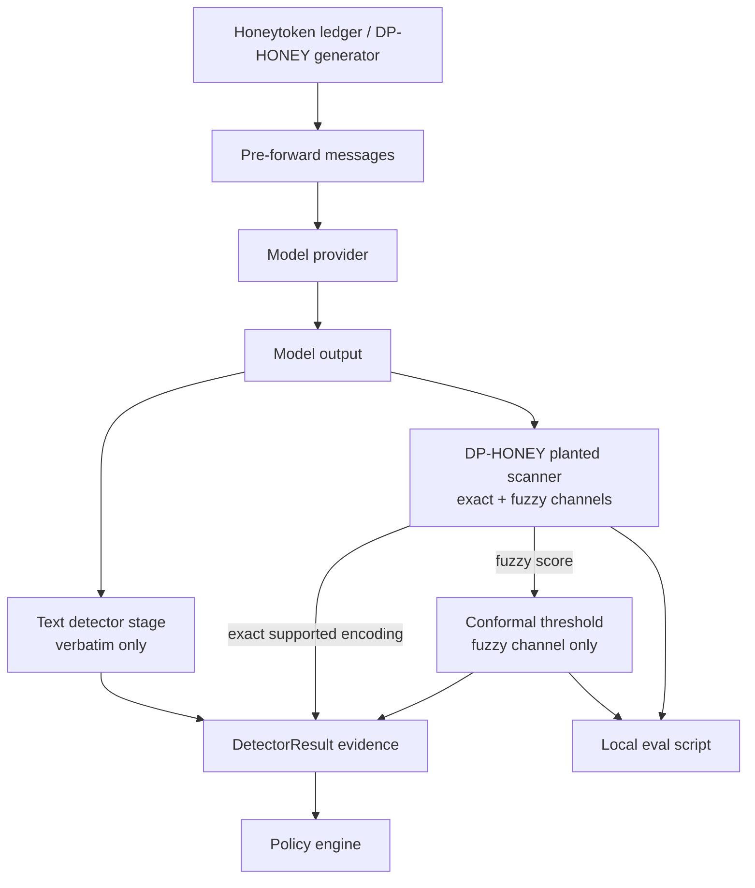

# feat: Complete DP-HONEY Detection and Eval

## Summary

Add the missing DP-HONEY detection and evaluation layer on top of the Aegis runtime branch: baseline post-output text detection, planted-value cross-encoding scanning, conformal fuzzy calibration, DP-HONEY pre/post stage behavior, and a deterministic local eval script. The work preserves the existing registry-derived credential scanner and auto-decoy behavior while adding a separate planted-value leakage path for known honeytokens.

---

## Problem Frame

The upstream requirements identify a gap between the current DP-HONEY generator/scanner package and the detection/evaluation checklist needed for the capstone demo. The existing `scan`/`auto-decoy` workflow finds secret-shaped strings and replaces them with synthetic decoys; it does not answer whether a finite set of known planted honeytokens appears in model output after encoding, transformation, or partial leakage.

The Aegis runtime branch already has a detector contract, honeytoken ledger, text canary detector, encoded canary detector, DP-HONEY generator adapter, and runtime tests. That is the right branch shape to extend because the final target is Aegis integration, not just the standalone generator package. The plan therefore treats the Aegis detector contract as canonical, while keeping the DP-HONEY package APIs usable and backwards compatible.

---

## Requirements

**Branch and Compatibility**

- R1. Plan and implement against the Aegis integration/runtime branch shape, where DP-HONEY lives under `src/detect/dp_honey` and runtime detectors live under `src/aegis`.
- R2. Preserve existing registry-derived scanner behavior: `scan`, `auto_decoy`, CLI `scan`, CLI `auto-decoy`, web UI scan, and web UI auto-decoy must remain compatible.
- R3. Produce a review-ready branch only; do not push, merge, or open a PR as part of implementation.

**Baseline Detector**

- R4. Provide an always-on post-output text detector stage that performs only cheap verbatim canary scanning.
- R5. Keep the baseline intentionally dark on encoded attacks so the CIFT encoding-gap demo remains visible.
- R6. Expose stage metadata equivalent to post-output phase, always-on behavior, and no whitebox requirement.

**Planted-Value Scanner**

- R7. Add a planted-value scanner that checks known honeytokens against one output without replacing the existing credential-shape scanner.
- R8. Exact detection must cover direct, reversed, leet-normalized, ROT-N, base64, base32, hex, decoded candidate substrings, encoded-token search, and within-output fragmentation.
- R9. Exact supported transformations are ground-truth block findings and do not depend on calibration thresholds.
- R10. Fuzzy/partial findings must expose a similarity score and channel metadata without echoing the planted value.
- R11. Cross-turn reconstruction remains out of scope.

**Conformal Stage**

- R12. Add split-conformal calibration for fuzzy/partial scores only, using deterministic held-out benign outputs.
- R13. Use the empirical q-hat rule from the origin requirement, with alpha defaulting to `0.05`.
- R14. Add a DP-HONEY stage path that injects honeytokens before forwarding, scans model output after generation, recommends `Action.BLOCK` for exact planted-value leakage, and blocks fuzzy leakage only when calibrated.

**Evaluation**

- R15. Add a deterministic local eval script that emits Table 2-style per-encoding precision/recall and conformal coverage.
- R16. Report eq.5 catch probability as `k / (m + k) * (1 - beta)` and support the current `m = 0` architecture.
- R17. Estimate beta with a local deterministic red-team/distinguisher surrogate, with an adapter seam for future Cameron/Spine outputs.
- R18. Emit catch probability versus `k` without adding a plotting dependency unless implementation chooses an optional artifact format.

**Verification**

- R19. Add focused tests for baseline darkness, all required encoding channels, conformal calibration, stage policy behavior, eval accounting, and non-regression of existing scanner/CLI/web UI behavior.
- R20. The Aegis quality gate should pass on the review branch, including linting, strict typing, import-boundary checks, and tests.

---

## Key Technical Decisions

- **KTD1. Aegis runtime branch as implementation base:** The final target is Aegis main, and Aegis main already contains the stage/detector contracts and honeytoken ledger. Starting from `DPHoneyTokenGenerator-integration` or the matching remote integration branch avoids re-creating runtime scaffolding in the standalone local `main` snapshot.
- **KTD2. Existing detector protocol is the stage contract:** Use Aegis `DetectorResult` and runtime post-generation detector semantics as the authoritative contract. Add small metadata-bearing stage wrappers only where the checklist or tests need explicit `phase`, `always_on`, or `requires_whitebox` fields.
- **KTD3. Separate planted-value scanning from credential-shape scanning:** Keep the public shape scanner stable and add explicit planted-value APIs. This avoids breaking CLI/web UI workflows and makes reviewer intent clear: generic secret-shape detection and known-honeytoken leakage detection are different products.
- **KTD4. Thresholds only for fuzzy/partial leakage:** Exact supported encodings should recommend `Action.BLOCK` deterministically. Conformal calibration belongs only to the fuzzy/partial score channel, preventing manual tuning from weakening exact leakage guarantees.
- **KTD5. Deterministic eval over new dependencies:** The eval should produce JSON/table data and catch-vs-k rows without requiring matplotlib or a model-service dependency. Cameron/Spine can later feed the same beta adapter shape.
- **KTD6. Audit-safe evidence:** Findings and detector evidence should carry identifiers, hashes, channels, spans where available, and scores, but not raw planted honeytoken values.

---

## High-Level Technical Design



The runtime path remains: detectors produce evidence, policy chooses the final action, and audit records both. The baseline detector and DP-HONEY planted scanner can be evaluated independently so the demo can show verbatim detection going dark while encoded DP-HONEY detection stays lit.

---

## Output Structure

The implementation should adjust exact placement to match the checked-out integration branch, but the expected shape is:

```text
src/aegis/stages/
  text_detector_stage.py
  dp_honey_stage.py
src/detect/dp_honey/
  scanner.py
  conformal.py
scripts/
  eval_dp_honey.py
tests/aegis/
  test_text_detector_stage.py
  test_dp_honey_stage.py
tests/dp_honey/
  test_dp_honey_planted_scanner.py
  test_dp_honey_conformal.py
  test_eval_dp_honey.py
```

If the implementation branch already has equivalent `src/aegis/detectors/*` modules, the stage files may be thin wrappers over those detectors rather than new independent engines.

---

## Implementation Units

### U1. Prepare branch base and preserve existing DP-HONEY contracts

- **Goal:** Establish the review branch on the Aegis integration/runtime base and protect the existing generator, registry scanner, CLI, and web UI behavior from accidental regressions.
- **Requirements:** R1, R2, R3, R19, R20; origin R20-R25.
- **Dependencies:** None.
- **Files:** `pyproject.toml`, `src/detect/dp_honey/scanner.py`, `src/detect/dp_honey/README.md`, `README.md`, `tests/dp_honey/test_dp_honey_scanner.py`, `tests/dp_honey/test_dp_honey_cli.py`, `tests/dp_honey/test_dp_honey_webui.py`.
- **Approach:** Start from the integration/runtime branch, not standalone `main`. Before adding behavior, identify whether the checked-out branch already has `src/aegis/detectors/canary.py`, `src/aegis/detectors/dp_honey.py`, `src/aegis/canaries/dp_honey.py`, and `src/detect/dp_honey/scanner.py`. Treat existing public APIs as non-regression contracts.
- **Execution note:** Begin with characterization coverage around any public scanner or CLI behavior that the implementation might touch.
- **Patterns to follow:** Existing DP-HONEY tests assert that findings omit raw matched values, CLI errors map through `DPHoneyError`, and web UI service functions stay testable without a server.
- **Test scenarios:**
  - Existing registry scanner still detects a checksum-valid GitHub token and returns `{format,start,end,confidence}` without the token value.
  - Existing CLI `scan` still omits matched values by default and only echoes them when explicitly opted in.
  - Existing web UI `run_scan` and `run_auto_decoy` still call the shape scanner, not the planted-value scanner.
  - Package docs no longer claim calibration/accounting are out of scope once this branch implements them.
- **Verification:** Existing DP-HONEY tests continue to pass after later units land; stale package README scope language is updated without changing safety disclaimers.

### U2. Add the cheap baseline text detector stage

- **Goal:** Provide a post-output, always-on, black-box-compatible detector that scans only for direct canary values.
- **Requirements:** R4, R5, R6, R19; origin R1-R3, F1, AE1.
- **Dependencies:** U1.
- **Files:** `src/aegis/stages/text_detector_stage.py`, `src/aegis/detectors/canary.py`, `tests/aegis/test_text_detector_stage.py`, `tests/aegis/test_canary_detector.py`.
- **Approach:** Reuse or wrap the existing text canary detector where available. The stage metadata should make the detector's execution phase and capability needs explicit without teaching it about encodings. Evidence should identify the canary record by safe metadata already used in Aegis, such as id and hash.
- **Patterns to follow:** `TextCanaryDetector` returns `DetectorResult`, degrades when model output is missing, and keeps raw canary values out of serialized evidence.
- **Test scenarios:**
  - Covers AE1. Output containing a direct planted value produces an intervention result and audit-safe evidence.
  - Covers AE1. Output containing only a base64 form of the planted value is allowed by the baseline detector.
  - Missing model response yields a degraded allow result rather than a crash.
  - Stage metadata reports post-output phase, always-on behavior, and no whitebox requirement.
- **Verification:** The baseline detector remains deliberately simple and can be used in demos to show the encoding gap.

### U3. Add planted-value cross-encoding scanner APIs

- **Goal:** Detect whether known planted honeytokens appear in output through direct, transformed, encoded, decoded, or within-output fragmented forms.
- **Requirements:** R7, R8, R9, R10, R11, R19; origin R4-R9, F2, AE2-AE4.
- **Dependencies:** U1.
- **Files:** `src/detect/dp_honey/scanner.py`, `tests/dp_honey/test_dp_honey_planted_scanner.py`, `tests/dp_honey/test_dp_honey_scanner.py`.
- **Approach:** Add explicit planted-value entry points to the scanner module while leaving `scan(text)` and `auto_decoy(text)` behavior intact. Use structured finding data for channel, exactness, score, safe token identifier/hash, and span when a span is meaningful. For candidate-substring decoding, bound search to plausible base64/base32/hex runs to avoid turning every output into an expensive decode attempt.
- **Technical design:** Directional channel model:
  - `exact`: direct, reverse, leet-normalized, ROT-N sweep, encoded-token search, decoded candidate substring, and deterministic within-output fragmentation.
  - `fuzzy`: partial similarity or LCS-ratio below exact-fragmentation criteria but above the score floor needed for calibration.
  - `none`: no supported evidence.
- **Patterns to follow:** Existing scanner uses local validation candidates but strips sensitive values from returned findings; the new planted scanner should follow the same safety posture.
- **Test scenarios:**
  - Covers AE2. Base64, base32, and hex encoded planted values are exact findings.
  - Covers AE2. Candidate substrings that decode to surrounding text containing the planted value are exact findings.
  - Covers AE3. Reversed and ROT-N variants are exact findings.
  - Covers AE3. Leet-normalized output maps back to the planted value without requiring a raw direct match.
  - Covers AE4. A planted value split by punctuation or whitespace within one output is detected as within-output fragmentation.
  - Covers AE4. A value split across two independent outputs is not reconstructed by this scanner.
  - Safe output with no supported channel returns no exact findings and only low fuzzy scores, if any.
  - Serialized findings do not contain the raw planted value.
- **Verification:** The planted scanner catches the requested encoding channels and existing shape-scanner tests remain unchanged.

### U4. Add conformal fuzzy calibration

- **Goal:** Provide deterministic conformal thresholding for fuzzy/partial scanner scores and keep exact scanner hits threshold-free.
- **Requirements:** R12, R13, R14, R19; origin R10-R13, F3, AE5.
- **Dependencies:** U3.
- **Files:** `src/detect/dp_honey/conformal.py`, `tests/dp_honey/test_dp_honey_conformal.py`.
- **Approach:** Implement a small calibration object that accepts benign scores, alpha, and score direction. The fuzzy nonconformity score in the origin is `max fuzzy similarity`, so thresholding should be explicit about whether larger scores are riskier. Use the adjusted empirical quantile rule from the origin and make the empty/invalid calibration set fail closed with a typed error.
- **Technical design:** Directional guidance:
  - Calibration input is a deterministic list of benign fuzzy scores.
  - Exact scanner findings bypass calibration.
  - Fuzzy findings compare their score against the q-hat threshold.
  - Coverage reporting counts benign examples accepted versus rejected under that threshold.
- **Patterns to follow:** DP-HONEY modules use small pure functions, dataclasses where useful, typed errors rooted in `DPHoneyError`, and deterministic tests.
- **Test scenarios:**
  - Covers AE5. With alpha `0.05`, q-hat is derived from the adjusted empirical quantile rather than a hard-coded threshold.
  - Calibration rejects alpha outside `(0, 1)` and empty benign sets with clear typed errors.
  - Exact findings are not changed by fuzzy calibration.
  - A fuzzy score below threshold allows; a fuzzy score at or above threshold blocks according to the chosen inclusive boundary.
  - Coverage report over held-out benign scores is deterministic and no worse than the intended alpha on the fixture distribution.
- **Verification:** Conformal behavior is reproducible, isolated, and has no dependency on real secrets or external model calls.

### U5. Add DP-HONEY pre/post stage integration

- **Goal:** Connect DP-HONEY honeytoken injection and planted-value scanning into the Aegis runtime stage model.
- **Requirements:** R6, R12, R14, R19; origin R12-R14, F2, F3.
- **Dependencies:** U2, U3, U4.
- **Files:** `src/aegis/stages/dp_honey_stage.py`, `src/aegis/detectors/dp_honey.py`, `src/aegis/canaries/dp_honey.py`, `src/aegis/canaries/ledger.py`, `tests/aegis/test_dp_honey_stage.py`, `tests/aegis/test_dp_honey_integration.py`, `tests/aegis/test_orchestrator.py`.
- **Approach:** Keep injection and detection separated. Pre-forward behavior should use the ledger/generator to plant DP-HONEY values and expose safe records to the post-output detector. Post-output behavior should run the planted scanner against those records, recommend `Action.BLOCK` for exact leakage, and recommend the configured calibrated action for fuzzy leakage.
- **Technical design:** Directional stage lifecycle:
  - Pre-forward: messages are transformed through existing honeytoken injection helpers and canary records are carried as safe metadata.
  - Model generation: unchanged Aegis provider path.
  - Post-output: baseline text detector and DP-HONEY planted scanner evaluate model output independently.
  - Policy: existing severity policy selects final intervention from detector results.
- **Patterns to follow:** Aegis `AegisRuntime` already separates pre-generation detectors, post-generation detectors, session detectors, policy, and audit. New behavior should return `DetectorResult` and not emit `PolicyDecision` directly.
- **Test scenarios:**
  - A pre-forward message with a credential placeholder receives a DP-HONEY-generated token and safe `SensitiveSpan` metadata.
  - A model output containing the exact planted token triggers a DP-HONEY detector result whose recommended action is `Action.BLOCK`.
  - A model output containing an encoded planted token triggers a DP-HONEY exact finding even when the baseline text detector allows.
  - A fuzzy-only output below the conformal threshold allows; above threshold blocks according to the stage policy.
  - Missing model output degrades cleanly.
  - Audit serialization does not include raw planted values.
- **Verification:** Runtime tests demonstrate the full pre-forward to post-output flow without importing research code or Cameron/Spine.

### U6. Add local DP-HONEY eval script and accounting

- **Goal:** Produce Table 2-style scanner metrics, conformal coverage, beta surrogate measurement, and eq.5 catch probability data from deterministic local fixtures.
- **Requirements:** R15, R16, R17, R18, R19, R20; origin R15-R19, F4, AE6.
- **Dependencies:** U3, U4.
- **Files:** `scripts/eval_dp_honey.py`, `tests/dp_honey/test_eval_dp_honey.py`, `README.md`, `src/detect/dp_honey/README.md`.
- **Approach:** Build a script with a library-friendly core so tests can call metric functions directly. Generate deterministic planted tokens from the DP-HONEY generator, synthesize per-encoding attack outputs, run the planted scanner, and compute precision/recall per encoding. Use a deterministic local distinguisher surrogate for beta, and leave a structured input seam for future Cameron/Spine results.
- **Technical design:** Directional output sections:
  - `table2`: rows by encoding channel with true positives, false positives, false negatives, precision, and recall.
  - `conformal`: alpha, q-hat, benign count, accepted benign count, and empirical coverage.
  - `accounting`: measured beta, m, k values, and catch probability rows.
  - `metadata`: seeds, token format, fixture sizes, and safety notes.
- **Patterns to follow:** Existing CLI/report code uses deterministic generation, JSON-friendly dictionaries, and explicit safety language. Keep the eval script importable and testable rather than only a command-line blob.
- **Test scenarios:**
  - Covers AE6. For `m = 0` and positive `k`, catch probability equals `1 - beta` within floating-point tolerance.
  - Precision/recall rows contain all required encoding channels and are deterministic for fixed seeds.
  - Conformal coverage section reports alpha, q-hat, and empirical benign coverage.
  - A Cameron/Spine-style external beta input can override or supplement the local surrogate without changing accounting formulas.
  - Script output is valid JSON or a stable table format suitable for review artifacts.
- **Verification:** The eval can run locally without external services and produces stable metrics for reviewers.

### U7. Update docs and handoff guidance

- **Goal:** Make the repository docs reflect the new detection/eval layer and provide clear review-branch merge guidance.
- **Requirements:** R1, R2, R3, R15-R20; origin R20-R25 and success criteria.
- **Dependencies:** U2, U3, U4, U5, U6.
- **Files:** `README.md`, `src/detect/dp_honey/README.md`, `tests/dp_honey/test_dp_honey_docs.py`.
- **Approach:** Update root Aegis docs to describe the new DP-HONEY planted-value detector, conformal fuzzy path, and eval script. Update package docs so they no longer list implemented detection/calibration/accounting as out of scope, while preserving strong safety language and the distinction between shape scanning and planted-value leakage scanning.
- **Patterns to follow:** Existing docs tests enforce command mentions, matrix consistency, and safety wording. Extend them only where doc contracts change; do not loosen safety assertions.
- **Test scenarios:**
  - Docs mention the eval script and planted-value scanner without claiming provider-valid credential detection.
  - Docs keep the existing CLI commands documented.
  - Docs distinguish registry shape scanning from planted-value leakage scanning.
  - Handoff text names review branch status and manual merge sequence without implying the branch has been pushed or merged.
- **Verification:** Documentation tests pass and reviewers can tell exactly what changed and what remains out of scope.

---

## Acceptance Examples

- AE1. A direct planted honeytoken in output triggers the baseline detector; the same token only in base64 does not trigger the baseline detector.
- AE2. Base64, base32, and hex forms of a planted value are exact DP-HONEY findings.
- AE3. ROT-N, reversed, and leet-normalized forms of a planted value are exact DP-HONEY findings.
- AE4. Within-output punctuation/whitespace fragmentation is detected; cross-turn reconstruction is not attempted.
- AE5. Fuzzy-only leakage is blocked only when its score crosses a conformal threshold derived from held-out benign scores.
- AE6. Eval accounting reports `k / (m + k) * (1 - beta)` and reduces to `1 - beta` when `m = 0` and `k` is positive.
- AE7. Existing registry scanner and auto-decoy workflows still omit matched values by default and preserve their response shape.

---

## System-Wide Impact

This work touches the detector/evidence path, not just a package utility. It affects Aegis runtime tests, audit-safety guarantees, documentation truthfulness, and the demo story around encoded leakage. The policy engine should not need new global behavior if detector severity recommendations are mapped carefully, but reviewers should inspect evidence serialization and intervention semantics closely.

The work should not introduce a dependency on the introspection research tree or Cameron/Spine. The eval script's surrogate beta path is a local research artifact; production/runtime detector behavior must stay deterministic and package-local.

---

## Risks & Dependencies

- **Branch-base mismatch:** Local `main` is a standalone DP-HONEY package, while Aegis main/integration has `src/aegis` and `src/detect`. Implementing against the wrong base would create avoidable merge churn.
- **Scanner confusion:** Extending `scanner.py` could accidentally change existing `scan` semantics. Keep the planted-value API explicit and add non-regression tests.
- **False-positive pressure:** Fuzzy detection is useful but risky. Conformal calibration and test fixtures must make the threshold behavior explainable and deterministic.
- **Evidence leakage:** Detection logic necessarily compares against raw planted values internally. Returned findings, detector evidence, audit events, and eval summaries must use identifiers/hashes and omit raw values unless a command explicitly opts into showing matches.
- **Eval overclaiming:** The local beta surrogate is not Cameron/Spine. Docs and output metadata should label it as a local deterministic surrogate until external red-team outputs are wired in.

---

## Scope Boundaries

- Pushing, merging, PR creation, or modifying `Aegis/main` directly is outside this plan.
- Cross-turn fragmentation and memory reconstruction remain NIMBUS work.
- Live provider credential validation and real-secret training remain outside the DP-HONEY safety boundary.
- The existing registry-derived scanner and auto-decoy flow are preserved, not replaced.
- Cameron/Spine execution is not required locally; only an adapter seam is planned.

### Deferred to Follow-Up Work

- Wire real Cameron/Spine red-team outputs into the beta adapter after those artifacts are available.
- Promote any eval output artifacts into formal paper/demo report assets if the capstone submission needs committed tables.
- Add a richer visualization artifact for catch-vs-k if the team later wants image output and accepts an additional plotting dependency.

---

## Documentation / Operational Notes

The final handoff from implementation should include:

- The review branch name and base branch.
- A statement that the branch was not pushed or merged.
- The local quality gate outcome.
- The eval script output location or a summarized Table 2/eq.5 result.
- Manual reviewer sequence: review branch, merge into `DPHoneyTokenGenerator-integration`, run the Aegis quality gate, then merge the integration branch into Aegis main after approval.

---

## Sources & Research

- `docs/brainstorms/2026-06-22-dp-honey-detection-eval-requirements.md` - upstream scope and acceptance examples.
- `src/aegis/core/contracts.py` - Aegis detector, policy, capability, and audit data contracts on the target branch.
- `src/aegis/core/orchestrator.py` - runtime execution order and detector protocol on the target branch.
- `src/aegis/detectors/canary.py` - existing exact and encoded canary detector patterns on the target branch.
- `src/aegis/detectors/dp_honey.py` - existing registry-scanner runtime adapter on the target branch.
- `src/aegis/canaries/dp_honey.py` and `src/aegis/canaries/ledger.py` - DP-HONEY generation and honeytoken injection path on the target branch.
- `src/detect/dp_honey/scanner.py` - existing credential-shape scanner to preserve.
- `tests/aegis/test_canary_detector.py` and `tests/aegis/test_dp_honey_integration.py` - target-branch runtime test patterns.
- `tests/dp_honey/test_dp_honey_scanner.py`, `tests/dp_honey/test_dp_honey_cli.py`, and `tests/dp_honey/test_dp_honey_webui.py` - package non-regression tests.
