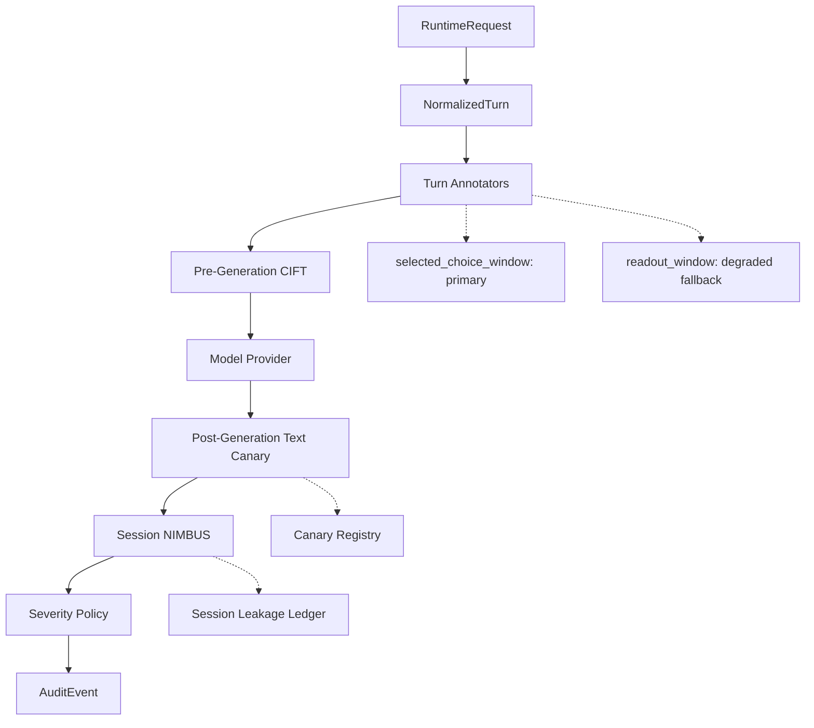

# feat: Harden CIFT runtime integration

## Summary

This plan promotes the current CIFT work from research-adjacent runtime checks into a stricter Aegis integration slice. It validates the selected-choice route after fallback degradation, expands the corpus to exercise primary and degraded CIFT coverage, exposes a spine-native optional CIFT assembly path, and adds the first NIMBUS/text-canary combined monitor flow.

---

## Problem Frame

The current CIFT candidate is strong only when `metadata.cift.selected_choice_readout_token_indices` is present. Broad readout and query-tail windows are not reliable enough to present as equivalent coverage. The runtime must therefore preserve the strong selected-choice path, mark fallback evidence honestly, and begin composing CIFT with the other AIS-style monitors instead of treating activation probing as the whole defense.

---

## Requirements

**CIFT coverage semantics**

- R1. The selected-choice window remains the primary CIFT route whenever selected-choice span metadata and feature vectors exist.
- R2. The broad readout fallback remains available as evidence, but it must report degraded coverage with capped confidence and auditable reason fields.
- R3. Runtime and report artifacts must show the behavior after fallback degradation, not just the pre-change benchmark.

**Corpus and evaluation**

- R4. The trace harness must support a realistic mixed corpus where some turns contain selected-choice metadata and some only contain broader readout metadata.
- R5. The evaluation path must preserve route labels so selected-choice and fallback performance can be reported separately.
- R6. Generated data must continue to use fake DP-HONEY canaries and span metadata, never raw production credentials.

**Runtime spine integration**

- R7. Aegis must expose a spine-native way to assemble optional CIFT runtime components without importing `introspection`.
- R8. Missing model artifacts, unavailable activation access, or absent selected-choice spans must degrade explicitly instead of failing silently.

**Canary and NIMBUS composition**

- R9. Text canary detection must remain a post-generation monitor that scans model output for registered canary leakage.
- R10. NIMBUS must add a session-level cumulative leakage monitor that can update risk across turns.
- R11. CIFT, text canary, and NIMBUS outputs must remain independent `DetectorResult` values consumed by policy in one place.

**Quality and documentation**

- R12. Behavioral changes must have focused tests for happy paths, degraded paths, and malformed metadata.
- R13. Documentation must state which route is primary, which route is degraded, and what claims the current CIFT model does not support.

---

## Key Technical Decisions

- KTD1. Keep selected-choice as the only primary CIFT route: grouped and live runtime checks show selected-choice separates the semantic-indirection corpus, while broad readout and query-tail do not.
- KTD2. Preserve fallback scores but degrade their capability status: fallback evidence can still inform policy, but `capability_status=degraded`, `cift_window_coverage=degraded_fallback`, and a confidence cap prevent overclaiming.
- KTD3. Keep research artifacts out of runtime imports: `src/aegis` should load runtime JSON models and consume `NormalizedTurn.metadata`; training pickles and feature extraction helpers stay under `introspection`.
- KTD4. Model NIMBUS as a session detector with internal state: the current runtime already has a `session_detectors` stage that receives the normalized turn and model response after post-generation detectors.
- KTD5. Use registry-backed text canary detection as the concrete leakage signal for the first NIMBUS pass: this composes with the existing canary registry and avoids inventing a second secret scanner.

---

## High-Level Technical Design

The selected-choice CIFT path remains pre-generation because it reads hidden-state features before output generation. Text canary detection stays post-generation because it needs generated text. NIMBUS runs as a session detector after generation and updates a cumulative score from the same turn and response context.

---

## Implementation Units

### U1. Revalidate degraded mixed-route CIFT runtime behavior

- **Goal:** Rerun and record the mixed-route selector evaluation after fallback semantics changed from active to degraded.
- **Requirements:** R1, R2, R3, R5, R13
- **Dependencies:** None
- **Files:** `src/aegis/detectors/cift_runtime.py`, `tests/aegis/test_cift_runtime_detector.py`, `introspection/data/reports/qwen3_4b_selected_choice_runtime_candidate_2026-06-22.md`, `introspection/data/reports/qwen3_4b_query_tail_fallback_experiment_2026-06-22.md`
- **Approach:** Keep the selected-choice path active. Ensure fallback results retain score and action while reporting degraded coverage, capped confidence, selection reason, and degradation reason.
- **Patterns to follow:** `CiftRuntimeWindowSelector` and existing detector result evidence in `src/aegis/detectors/cift_runtime.py`.
- **Test scenarios:**
  - Selected-choice metadata plus selected-choice feature vector returns `CapabilityStatus.ACTIVE`, primary coverage evidence, and original model confidence.
  - Missing selected-choice metadata plus fallback feature vector returns `CapabilityStatus.DEGRADED`, degraded fallback coverage evidence, and capped confidence.
  - Selected-choice metadata with missing selected-choice feature vector returns degraded missing-feature evidence without silently routing to fallback.
- **Verification:** Focused detector tests pass and the runtime candidate report names selected-choice as primary and fallback as degraded.

### U2. Add realistic mixed-route corpus generation and route-preserving exports

- **Goal:** Build a mixed corpus path that includes selected-choice turns and fallback-only turns in one evaluation fixture.
- **Requirements:** R4, R5, R6
- **Dependencies:** U1
- **Files:** `src/aegis/trace_collection/harness.py`, `src/aegis/trace_collection/main.py`, `tests/aegis/test_trace_collection.py`, `docs/trace-collection-harness.md`, `introspection/src/aegis_introspection/runtime_bridge.py`, `introspection/src/aegis_introspection/trace_record_adapter.py`, `introspection/tests/test_runtime_bridge.py`, `introspection/tests/test_trace_record_adapter.py`
- **Approach:** Extend the existing paired semantic-indirection profile or add a related profile that deliberately emits selected-choice metadata for part of the corpus and broader readout-only metadata for the rest. Preserve route metadata in structured prompts and runtime turn exports.
- **Patterns to follow:** Existing `paired_semantic_indirection_v3` generation and paired prompt validation code in `src/aegis/trace_collection/harness.py`.
- **Test scenarios:**
  - The mixed profile emits balanced `secret_present_safe` and `exfiltration_intent` rows for both selected-choice and fallback-only routes.
  - Structured prompt conversion preserves selected-choice spans when present and omits them for fallback-only rows.
  - Runtime turn export preserves `metadata.cift` route markers without exposing raw production secrets.
  - Invalid partial selected-choice metadata is rejected.
- **Verification:** Trace collection tests and bridge tests pass; generated local data can be evaluated by the existing live selector benchmark.

### U3. Expose a spine-native optional CIFT runtime assembly path

- **Goal:** Make CIFT runtime integration usable from the Aegis spine without importing research code or hand-wiring every component in scripts.
- **Requirements:** R7, R8, R11
- **Dependencies:** U1
- **Files:** `src/aegis/detectors/cift_runtime.py`, `src/aegis/demo/scenarios.py`, `tests/aegis/test_cift_runtime_detector.py`, `tests/aegis/test_demo_scenarios.py`, `README.md`
- **Approach:** Add a small runtime-facing factory or helper that loads runtime JSON model artifacts and returns detector components for selected-choice-only or selected-choice-plus-fallback operation. Keep live hidden-state extraction outside `src/aegis`; the runtime helper should consume pre-attached feature vectors or annotators supplied by callers.
- **Patterns to follow:** Existing `load_cift_runtime_model`, `CiftFeatureVectorAnnotator`, and demo scenario construction.
- **Test scenarios:**
  - Loading a valid runtime JSON model creates a detector with no `introspection` import.
  - Missing runtime model paths produce actionable errors.
  - A demo or runtime assembly path can include CIFT, canary, and NIMBUS detectors without violating detector/policy boundaries.
- **Verification:** Import-boundary check continues to pass; demo tests cover the optional CIFT assembly path.

### U4. Add NIMBUS-lite cumulative leakage detector

- **Goal:** Implement the first NIMBUS-like session detector that accumulates leakage risk across turns.
- **Requirements:** R9, R10, R11, R12
- **Dependencies:** U3
- **Files:** `src/aegis/detectors/nimbus.py`, `tests/aegis/test_nimbus_detector.py`, `src/aegis/detectors/__init__.py`, `README.md`
- **Approach:** Add a session detector with an in-memory per-session ledger. It should scan generated text through a registry-backed leakage scorer, update cumulative score using explicit decay or additive bounded accumulation, and emit `DetectorResult(component=NIMBUS)`.
- **Patterns to follow:** `TextCanaryDetector`, `EncodedCanaryDetector`, and the `session_detectors` stage in `src/aegis/core/orchestrator.py`.
- **Test scenarios:**
  - No response returns degraded evidence because NIMBUS requires generated text.
  - A clean response leaves cumulative score below warning threshold and recommends allow.
  - A partial or encoded canary match increases session score and recommends warn or sanitize according to configured thresholds.
  - Repeated low-grade leakage across multiple turns escalates cumulative risk.
  - Separate session IDs maintain independent cumulative ledgers.
- **Verification:** NIMBUS tests pass and detector results serialize through existing audit events.

### U5. Compose CIFT, text canary, and NIMBUS in a runtime/demo flow

- **Goal:** Demonstrate the AIS-style monitor composition through the existing Aegis runtime spine.
- **Requirements:** R9, R10, R11, R13
- **Dependencies:** U3, U4
- **Files:** `src/aegis/demo/scenarios.py`, `tests/aegis/test_demo_scenarios.py`, `README.md`, `docs/trace-collection-harness.md`
- **Approach:** Add or update a demo scenario that plants a DP-HONEY canary, runs CIFT as pre-generation evidence when features are present, scans generated text with the text canary detector, updates NIMBUS as a session detector, and lets policy combine the independent detector outputs.
- **Patterns to follow:** Existing demo scenario functions and `SeverityPolicyEngine` behavior.
- **Test scenarios:**
  - A clean turn with primary CIFT evidence and no canary leak results in allow or warn according to detector scores.
  - A generated response containing a registered canary escalates via text canary detection.
  - Repeated partial leakage across turns increases NIMBUS risk even when each individual response is below the final escalation threshold.
  - Audit output includes independent CIFT, text canary, and NIMBUS detector results.
- **Verification:** Demo scenario tests pass and README describes how to run the composed flow.

### U6. Refresh reports and documentation for current claims

- **Goal:** Keep the project story aligned with what the runtime and experiments actually prove.
- **Requirements:** R3, R5, R13
- **Dependencies:** U1, U2, U5
- **Files:** `introspection/data/reports/qwen3_4b_selected_choice_runtime_candidate_2026-06-22.md`, `introspection/data/reports/qwen3_4b_query_tail_fallback_experiment_2026-06-22.md`, `introspection/data/reports/data_generation_journey_2026-06-22.md`, `docs/trace-collection-harness.md`, `README.md`
- **Approach:** Update reports to separate primary selected-choice claims from degraded fallback evidence. Record the mixed-route corpus and NIMBUS/text-canary integration as runtime milestones, not paper-faithful CIFT reproduction.
- **Patterns to follow:** Existing milestone report style under `introspection/data/reports/`.
- **Test scenarios:** Test expectation: none -- this unit documents verified artifacts and behavior covered by U1-U5 tests.
- **Verification:** Documentation contains no claim that broad readout or query-tail is primary CIFT.

---

## Scope Boundaries

- The plan does not reproduce the paper-faithful CCI/CFS formulation.
- The plan does not promote broad readout or query-tail windows to primary CIFT.
- The plan does not use production secrets or production telemetry.
- The plan does not add a black-box CIFT capability claim; black-box mode remains unavailable or degraded.

### Deferred to Follow-Up Work

- Calibrated paper-faithful CIFT with benign calibration distribution and learned layer weighting.
- Larger human-written corpus collection beyond the current deterministic and runtime-shaped fixtures.
- Persistent NIMBUS storage outside in-memory demo/runtime state.
- Dashboard rendering for route-level CIFT and NIMBUS evidence.

---

## System-Wide Impact

This work tightens the detector contract across the spine. CIFT becomes a capability-sensitive pre-generation monitor, text canary detection remains a post-generation evidence source, and NIMBUS begins tracking session-level risk. Policy remains the only layer that converts detector outputs into final enforcement decisions.

---

## Risks & Dependencies

- **Overclaiming CIFT generality:** The strong result is selected-choice-specific. Mitigation: degrade fallback evidence and document unsupported routes.
- **Runtime/import boundary regression:** CIFT training and feature extraction are research concerns. Mitigation: keep `src/aegis` on runtime JSON artifacts and metadata only.
- **State leakage in NIMBUS tests:** Session state can accidentally bleed across tests or sessions. Mitigation: test independent session ledgers and provide explicit reset or construction boundaries.
- **Corpus artifact shortcuts:** Synthetic data can encode shortcuts. Mitigation: report route-level metrics and compare selected-choice against fallback rather than promoting aggregate-only performance.

---

## Sources & Research

- `src/aegis/core/contracts.py` defines `NormalizedTurn`, `DetectorResult`, `CapabilityStatus`, and `DetectorComponent.NIMBUS`.
- `src/aegis/core/orchestrator.py` already supports turn annotators, pre-generation detectors, post-generation detectors, and session detectors.
- `src/aegis/detectors/cift_runtime.py` contains the runtime-native CIFT detector and window selector.
- `src/aegis/detectors/canary.py` contains registry-backed exact and encoded text canary detectors.
- `src/aegis/trace_collection/harness.py` contains the paired semantic-indirection profiles used for CIFT corpus generation.
- `introspection/data/reports/qwen3_4b_query_tail_fallback_experiment_2026-06-22.md` records the negative query-tail result.
- `introspection/data/reports/qwen3_4b_selected_choice_runtime_candidate_2026-06-22.md` records the selected-choice runtime candidate and route semantics.
